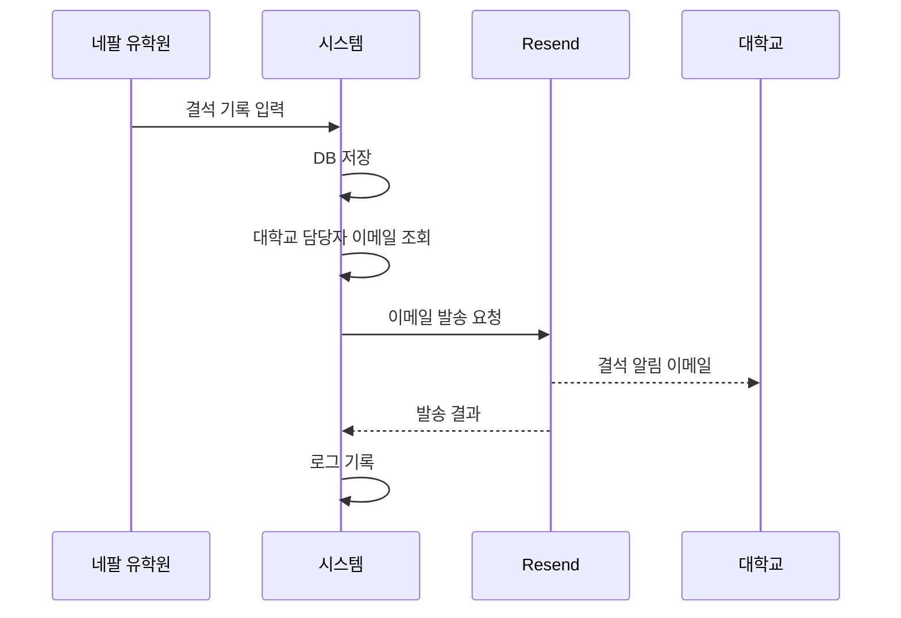

# 외국인 유학생 리스크 관리 ERP - 개발 로드맵

> **문서 버전**: 1.0  
> **최종 수정일**: 2026년 1월 8일  
> **기술 스택**: Next.js 15 + TypeScript + Supabase + Tailwind CSS + Resend + react-pdf

---

## 1. 개발 개요

본 로드맵은 외국인 유학생 리스크 관리 ERP 시스템의 단계별 구현 계획을 정의합니다.

### 1.1 개발 원칙

| 원칙 | 설명 |
|------|------|
| **Mobile-First** | 네팔 유학원 대표의 모바일 사용 환경 우선 |
| **점진적 배포** | 각 Phase 완료 시 Vercel 배포 및 검증 |
| **보안 우선** | RLS 및 역할 기반 접근 제어 철저 적용 |
| **사용성 중심** | 최소 클릭으로 핵심 기능 수행 가능 |

### 1.2 예상 일정

| Phase | 기간 | 주요 산출물 |
|-------|------|-------------|
| Phase 0 | 1일 | 프로젝트 초기화, 환경 설정 |
| Phase 1 | 3일 | 인증 시스템, 역할 기반 라우팅 |
| Phase 2 | 2일 | 대학교/사용자 관리 |
| Phase 3 | 4일 | 학생 관리 (CRUD) |
| Phase 4 | 3일 | 결석 관리 및 알림 |
| Phase 5 | 2일 | Quarterly Check-in |
| Phase 6 | 3일 | 월간 리포트 (PDF) |
| Phase 7 | 2일 | 감사 로그 및 보안 강화 |
| Phase 8 | 2일 | 테스트 및 최종 배포 |

---

## 2. Phase 0: 프로젝트 초기화

> **목표**: 개발 환경 설정 및 기본 프로젝트 구조 완성

### 2.1 작업 목록

- [x] Next.js 15 프로젝트 생성 (App Router)
- [x] TypeScript + Tailwind CSS 설정
- [x] Supabase 클라이언트 구성 (`src/lib/supabase/`)
- [x] 환경 변수 설정 (`.env.local`)
- [x] 기본 타입 정의 (`src/types/database.ts`)
- [ ] ESLint + Prettier 설정 최적화
- [ ] Vercel 프로젝트 연결 및 초기 배포

### 2.2 디렉토리 구조

```
src/
├── app/                    # Next.js App Router 페이지
│   ├── (auth)/            # 인증 관련 페이지
│   ├── (dashboard)/       # 대시보드 페이지
│   │   ├── admin/         # 관리자 대시보드
│   │   ├── agency/        # 네팔 유학원 대시보드
│   │   └── university/    # 대학교 국제처 대시보드
│   └── api/               # API 라우트
├── components/            # 재사용 컴포넌트
│   ├── ui/               # 기본 UI 컴포넌트
│   └── forms/            # 폼 컴포넌트
├── lib/                   # 유틸리티
│   ├── supabase/         # Supabase 클라이언트
│   ├── email/            # Resend 이메일
│   └── pdf/              # react-pdf
├── hooks/                 # 커스텀 훅
└── types/                 # TypeScript 타입
```

---

## 3. Phase 1: 인증 및 권한 시스템

> **목표**: Supabase Auth 기반 로그인/로그아웃 및 역할 기반 라우팅

### 3.1 데이터베이스 스키마

```sql
-- 사용자 역할 ENUM
CREATE TYPE user_role AS ENUM ('admin', 'nepal_agency', 'university');

-- 사용자 테이블 (Supabase auth.users 확장)
CREATE TABLE public.users (
  id UUID PRIMARY KEY REFERENCES auth.users(id) ON DELETE CASCADE,
  email TEXT NOT NULL,
  role user_role NOT NULL DEFAULT 'university',
  university_id UUID REFERENCES universities(id),
  created_at TIMESTAMPTZ DEFAULT NOW()
);

-- RLS 정책
ALTER TABLE public.users ENABLE ROW LEVEL SECURITY;

CREATE POLICY "Users can read own data" ON public.users
  FOR SELECT USING (auth.uid() = id);

CREATE POLICY "Admin can read all users" ON public.users
  FOR SELECT USING (
    EXISTS (SELECT 1 FROM public.users WHERE id = auth.uid() AND role = 'admin')
  );
```

### 3.2 작업 목록

| 작업 | 파일 | 우선순위 |
|------|------|----------|
| 로그인 페이지 | `src/app/(auth)/login/page.tsx` | P0 |
| 인증 미들웨어 | `src/middleware.ts` | P0 |
| 세션 관리 훅 | `src/hooks/useAuth.ts` | P0 |
| 역할 기반 리다이렉트 | `src/lib/auth/redirect.ts` | P0 |
| 로그아웃 기능 | `src/components/LogoutButton.tsx` | P1 |
| 비밀번호 변경 | `src/app/(dashboard)/settings/page.tsx` | P2 |

### 3.3 역할별 라우팅

| 역할 | 로그인 후 리다이렉트 | 접근 가능 경로 |
|------|---------------------|----------------|
| `admin` | `/admin` | 전체 |
| `nepal_agency` | `/agency` | `/agency/*` |
| `university` | `/university` | `/university/*` |

---

## 4. Phase 2: 대학교 및 사용자 관리

> **목표**: 관리자용 대학교/사용자 CRUD 기능

### 4.1 데이터베이스 스키마

```sql
-- 대학교 테이블
CREATE TABLE public.universities (
  id UUID PRIMARY KEY DEFAULT gen_random_uuid(),
  name TEXT NOT NULL UNIQUE,
  created_at TIMESTAMPTZ DEFAULT NOW()
);

-- 대학교 담당자 이메일 테이블
CREATE TABLE public.university_contacts (
  id UUID PRIMARY KEY DEFAULT gen_random_uuid(),
  university_id UUID NOT NULL REFERENCES universities(id) ON DELETE CASCADE,
  email TEXT NOT NULL,
  is_primary BOOLEAN DEFAULT false,
  created_at TIMESTAMPTZ DEFAULT NOW(),
  UNIQUE(university_id, email)
);
```

### 4.2 작업 목록

| 작업 | 파일 | 설명 |
|------|------|------|
| 대학교 목록 | `src/app/(dashboard)/admin/universities/page.tsx` | 전체 대학교 조회 |
| 대학교 추가 | `src/app/(dashboard)/admin/universities/new/page.tsx` | 대학교 등록 폼 |
| 대학교 상세 | `src/app/(dashboard)/admin/universities/[id]/page.tsx` | 상세 정보 + 수정 |
| 담당자 관리 | `src/components/forms/UniversityContactForm.tsx` | 이메일 1~2명 등록 |
| 사용자 목록 | `src/app/(dashboard)/admin/users/page.tsx` | 전체 사용자 조회 |
| 사용자 등록 | `src/app/(dashboard)/admin/users/new/page.tsx` | ID/PW 발급 |

---

## 5. Phase 3: 학생 관리

> **목표**: 학생 정보 CRUD 및 개인정보 동의서 업로드

### 5.1 데이터베이스 스키마

```sql
-- 학생 프로그램 ENUM
CREATE TYPE student_program AS ENUM ('language', 'bachelor', 'master', 'phd');

-- 학생 상태 ENUM
CREATE TYPE student_status AS ENUM ('enrolled', 'graduated', 'completed', 'withdrawn', 'expelled');

-- 학생 테이블
CREATE TABLE public.students (
  id UUID PRIMARY KEY DEFAULT gen_random_uuid(),
  university_id UUID NOT NULL REFERENCES universities(id),
  student_no TEXT NOT NULL,
  name TEXT NOT NULL,
  department TEXT NOT NULL,
  program student_program NOT NULL,
  address TEXT NOT NULL,
  phone TEXT NOT NULL,
  email TEXT,
  status student_status NOT NULL DEFAULT 'enrolled',
  consent_file_url TEXT,
  created_at TIMESTAMPTZ DEFAULT NOW(),
  updated_at TIMESTAMPTZ DEFAULT NOW(),
  UNIQUE(university_id, program, student_no)
);

-- RLS 정책
ALTER TABLE public.students ENABLE ROW LEVEL SECURITY;

CREATE POLICY "Admin can access all students" ON public.students
  FOR ALL USING (
    EXISTS (SELECT 1 FROM public.users WHERE id = auth.uid() AND role = 'admin')
  );

CREATE POLICY "Agency can access all students" ON public.students
  FOR ALL USING (
    EXISTS (SELECT 1 FROM public.users WHERE id = auth.uid() AND role = 'nepal_agency')
  );

CREATE POLICY "University can read own students" ON public.students
  FOR SELECT USING (
    university_id = (SELECT university_id FROM public.users WHERE id = auth.uid())
  );
```

### 5.2 작업 목록

| 작업 | 파일 | 역할 |
|------|------|------|
| 학생 목록 | `src/app/(dashboard)/agency/students/page.tsx` | Agency, Admin |
| 학생 등록 | `src/app/(dashboard)/agency/students/new/page.tsx` | Agency, Admin |
| 학생 상세 | `src/app/(dashboard)/agency/students/[id]/page.tsx` | 전체 |
| 학생 수정 | `src/app/(dashboard)/agency/students/[id]/edit/page.tsx` | Agency, Admin |
| 동의서 업로드 | `src/components/forms/ConsentUpload.tsx` | Agency |
| 대학별 학생 조회 | `src/app/(dashboard)/university/students/page.tsx` | University |
| 학생 검색/필터 | `src/components/StudentFilter.tsx` | 전체 |

### 5.3 UI 요구사항

- **모바일 최적화**: 학생 등록 폼은 모바일에서 사용하기 쉬운 단일 컬럼 레이아웃
- **대학교 드롭다운**: 검색 가능한 Select 컴포넌트
- **상태 변경**: 졸업/수료/자퇴/제적 상태 업데이트 시 확인 모달

---

## 6. Phase 4: 결석 관리 및 알림

> **목표**: 결석 기록, 증빙 업로드, 대학교 이메일 알림

### 6.1 데이터베이스 스키마

```sql
-- 결석 사유 ENUM
CREATE TYPE absence_reason AS ENUM ('illness', 'personal', 'other');

-- 결석 테이블
CREATE TABLE public.absences (
  id UUID PRIMARY KEY DEFAULT gen_random_uuid(),
  student_id UUID NOT NULL REFERENCES students(id) ON DELETE CASCADE,
  absence_date DATE NOT NULL,
  reason absence_reason NOT NULL,
  note TEXT,
  created_by UUID NOT NULL REFERENCES users(id),
  created_at TIMESTAMPTZ DEFAULT NOW()
);

-- 결석 증빙 파일 테이블
CREATE TABLE public.absence_files (
  id UUID PRIMARY KEY DEFAULT gen_random_uuid(),
  absence_id UUID NOT NULL REFERENCES absences(id) ON DELETE CASCADE,
  file_path TEXT NOT NULL,  -- Supabase Storage 경로
  original_name TEXT NOT NULL,
  created_at TIMESTAMPTZ DEFAULT NOW()
);
```

### 6.2 작업 목록

| 작업 | 파일 | 설명 |
|------|------|------|
| 결석 등록 폼 | `src/components/forms/AbsenceForm.tsx` | 모바일 최적화 |
| 결석 목록 | `src/app/(dashboard)/agency/absences/page.tsx` | 날짜별/학생별 필터 |
| 증빙 업로드 | `src/lib/storage/upload.ts` | Supabase Storage 활용 |
| 이메일 알림 API | `src/app/api/notify/absence/route.ts` | Resend 연동 |
| 이메일 템플릿 | `src/lib/email/templates/absence.ts` | PRD 템플릿 적용 |
| 발송 실패 로그 | `src/lib/email/logger.ts` | 실패 시 재시도 로직 |

### 6.3 이메일 발송 플로우



### 6.4 민감정보 처리

> [!CAUTION]
> 결석 알림 이메일에 진단서, 질병명 등 민감 정보는 포함하지 않습니다.
> 전송 항목: 학생명, 학번, 결석일, 사유 코드(질병/개인사정/기타)만 전송

---

## 7. Phase 5: Quarterly Check-in

> **목표**: 분기별 학생 연락처 확인 및 변경 이력 관리

### 7.1 데이터베이스 스키마

```sql
-- 분기별 점검 테이블
CREATE TABLE public.quarterly_checkins (
  id UUID PRIMARY KEY DEFAULT gen_random_uuid(),
  student_id UUID NOT NULL REFERENCES students(id) ON DELETE CASCADE,
  check_in_date DATE NOT NULL,
  phone_verified BOOLEAN DEFAULT false,
  address_verified BOOLEAN DEFAULT false,
  email_verified BOOLEAN DEFAULT false,
  checked_by UUID NOT NULL REFERENCES users(id),
  created_at TIMESTAMPTZ DEFAULT NOW()
);

-- 연락처 변경 이력 테이블
CREATE TABLE public.contact_change_logs (
  id UUID PRIMARY KEY DEFAULT gen_random_uuid(),
  student_id UUID NOT NULL REFERENCES students(id) ON DELETE CASCADE,
  field_name TEXT NOT NULL,  -- 'phone', 'address', 'email'
  old_value TEXT,
  new_value TEXT NOT NULL,
  changed_by UUID NOT NULL REFERENCES users(id),
  check_in_date DATE,
  created_at TIMESTAMPTZ DEFAULT NOW()
);
```

### 7.2 작업 목록

| 작업 | 파일 | 설명 |
|------|------|------|
| 점검 대상 목록 | `src/app/(dashboard)/agency/checkin/page.tsx` | 미점검 학생 필터 |
| 점검 폼 | `src/components/forms/CheckinForm.tsx` | 체크박스 UI |
| 연락처 수정 | `src/components/forms/ContactUpdateForm.tsx` | 변경 시 자동 로그 |
| 변경 이력 조회 | `src/app/(dashboard)/admin/logs/contacts/page.tsx` | Admin 전용 |
| 점검 기한 알림 | `src/lib/cron/checkin-reminder.ts` | (선택) Vercel Cron |

### 7.3 점검 프로세스

1. 분기 시작 시 점검 대상 학생 목록 자동 생성
2. 네팔 유학원이 학생 대면 후 연락처 일치 확인
3. 변경 사항 있을 시 즉시 수정 → 변경 로그 자동 기록
4. 점검 완료 체크 시 `check_in_date` 기록

---

## 8. Phase 6: 월간 리포트 (PDF)

> **목표**: On-demand PDF 리포트 생성 및 만료 링크 제공

### 8.1 작업 목록

| 작업 | 파일 | 설명 |
|------|------|------|
| PDF 템플릿 | `src/lib/pdf/templates/MonthlyReport.tsx` | react-pdf 컴포넌트 |
| 리포트 생성 API | `src/app/api/reports/monthly/route.ts` | 동적 PDF 생성 |
| 만료 링크 생성 | `src/lib/storage/signed-url.ts` | 24시간 유효 URL |
| 리포트 요청 UI | `src/app/(dashboard)/university/reports/page.tsx` | 월 선택 + 다운로드 |
| 이메일 발송 | `src/app/api/reports/send/route.ts` | PDF 링크 이메일 전송 |

### 8.2 리포트 구성 요소

```tsx
// react-pdf 컴포넌트 구조
<Document>
  <Page>
    <Header>
      <Logo />
      <ReportTitle month={month} year={year} />
      <Disclaimer text="정보 제공/관리 기록 목적" />
    </Header>
    
    <Summary>
      <TotalStudents count={100} />
      <AbsenceCount count={15} />
      <AbsenceRate rate={2.5} />
    </Summary>
    
    <AbsenceByReason data={reasonBreakdown} />
    <RiskStudents students={threeOrMoreAbsences} />
    <MonthOverMonthChange data={comparison} />
    <VisaRenewalList students={upcomingRenewals} />
    
    <Footer timestamp={generatedAt} />
  </Page>
</Document>
```

### 8.3 보안 요구사항

- PDF 파일은 Storage에 저장하지 않음 (메모리에서 직접 생성)
- Signed URL은 24시간 후 자동 만료
- 다운로드 시 감사 로그 기록

---

## 9. Phase 7: 감사 로그 및 보안 강화

> **목표**: 접속/다운로드 로그 기록, 데이터 파기 정책 구현

### 9.1 데이터베이스 스키마

```sql
-- 감사 로그 테이블
CREATE TABLE public.audit_logs (
  id UUID PRIMARY KEY DEFAULT gen_random_uuid(),
  user_id UUID REFERENCES users(id),
  action_type TEXT NOT NULL,  -- 'login', 'logout', 'download', 'view'
  details JSONB,  -- 추가 정보 (파일명, 학생 ID 등)
  ip_address INET,
  created_at TIMESTAMPTZ DEFAULT NOW()
);

-- 인덱스
CREATE INDEX idx_audit_logs_user_id ON public.audit_logs(user_id);
CREATE INDEX idx_audit_logs_action_type ON public.audit_logs(action_type);
CREATE INDEX idx_audit_logs_created_at ON public.audit_logs(created_at);
```

### 9.2 작업 목록

| 작업 | 파일 | 설명 |
|------|------|------|
| 로그인 로그 | `src/lib/audit/login.ts` | 로그인 성공/실패 기록 |
| 다운로드 로그 | `src/lib/audit/download.ts` | PDF/파일 다운로드 기록 |
| 로그 조회 UI | `src/app/(dashboard)/admin/logs/page.tsx` | 필터링 + 페이지네이션 |
| 데이터 파기 배치 | `src/lib/cron/data-purge.ts` | 졸업 후 1년 경과 데이터 |
| Soft Delete 구현 | `src/lib/db/soft-delete.ts` | deleted_at 컬럼 활용 |

### 9.3 데이터 파기 정책

| 데이터 유형 | 보관 기간 | 파기 절차 |
|-------------|-----------|-----------|
| 학생 개인정보 | 졸업/수료 후 1년 | Soft Delete → 30일 후 Hard Delete |
| 결석 기록 | 졸업/수료 후 1년 | Soft Delete → 30일 후 Hard Delete |
| 증빙 파일 | 졸업/수료 후 1년 | Storage에서 영구 삭제 |
| 접속/다운로드 로그 | 3년 | 자동 Hard Delete |

---

## 10. Phase 8: 테스트 및 최종 배포

> **목표**: E2E 테스트, 성능 최적화, 프로덕션 배포

### 10.1 작업 목록

| 작업 | 도구 | 설명 |
|------|------|------|
| 단위 테스트 | Vitest | 핵심 함수 테스트 |
| E2E 테스트 | Playwright | 주요 사용자 플로우 |
| 성능 테스트 | Lighthouse | Core Web Vitals 최적화 |
| 보안 점검 | OWASP 체크리스트 | XSS, CSRF, SQL Injection |
| 환경 변수 설정 | Vercel | 프로덕션 환경 변수 |
| 도메인 연결 | Vercel | 커스텀 도메인 설정 |
| 모니터링 설정 | Vercel Analytics | 에러 트래킹 |

### 10.2 테스트 시나리오

#### 10.2.1 인증 플로우

- [ ] 관리자 로그인 → `/admin` 리다이렉트
- [ ] 네팔 유학원 로그인 → `/agency` 리다이렉트
- [ ] 대학교 로그인 → `/university` 리다이렉트
- [ ] 비밀번호 변경 성공
- [ ] 로그아웃 후 보호된 페이지 접근 불가

#### 10.2.2 학생 관리

- [ ] 학생 등록 → 목록에 표시
- [ ] 학생 정보 수정 → 변경 반영
- [ ] 동의서 업로드 → Storage 저장 확인
- [ ] 대학교 계정으로 소속 학생만 조회 가능

#### 10.2.3 결석 관리

- [ ] 결석 등록 → 이메일 발송 확인
- [ ] 증빙 파일 업로드 → UUID 파일명으로 저장
- [ ] 3회 이상 결석 학생 위험군 표시

#### 10.2.4 리포트

- [ ] 월간 리포트 PDF 생성
- [ ] 24시간 만료 링크 동작 확인
- [ ] 다운로드 로그 기록 확인

---

## 11. 기술 스택 상세

| 카테고리 | 기술 | 버전 | 용도 |
|----------|------|------|------|
| **Framework** | Next.js | 15.x | App Router, Server Actions |
| **Language** | TypeScript | 5.x | 타입 안정성 |
| **Styling** | Tailwind CSS | 3.x | 유틸리티 기반 스타일링 |
| **Database** | Supabase (PostgreSQL) | - | 데이터 저장, RLS |
| **Auth** | Supabase Auth | - | 사용자 인증 |
| **Storage** | Supabase Storage | - | 파일 업로드 |
| **Email** | Resend | - | 트랜잭셔널 이메일 |
| **PDF** | react-pdf | 3.x | PDF 생성 |
| **Deployment** | Vercel | - | 서버리스 배포 |

---

## 12. API 엔드포인트 목록

### 12.1 인증

| Method | Endpoint | 설명 |
|--------|----------|------|
| POST | `/api/auth/login` | 로그인 |
| POST | `/api/auth/logout` | 로그아웃 |
| POST | `/api/auth/change-password` | 비밀번호 변경 |

### 12.2 대학교

| Method | Endpoint | 설명 |
|--------|----------|------|
| GET | `/api/universities` | 대학교 목록 |
| POST | `/api/universities` | 대학교 등록 |
| GET | `/api/universities/[id]` | 대학교 상세 |
| PUT | `/api/universities/[id]` | 대학교 수정 |
| DELETE | `/api/universities/[id]` | 대학교 삭제 |

### 12.3 학생

| Method | Endpoint | 설명 |
|--------|----------|------|
| GET | `/api/students` | 학생 목록 (필터링) |
| POST | `/api/students` | 학생 등록 |
| GET | `/api/students/[id]` | 학생 상세 |
| PUT | `/api/students/[id]` | 학생 수정 |
| PUT | `/api/students/[id]/status` | 상태 변경 |

### 12.4 결석

| Method | Endpoint | 설명 |
|--------|----------|------|
| GET | `/api/absences` | 결석 목록 |
| POST | `/api/absences` | 결석 등록 + 이메일 발송 |
| DELETE | `/api/absences/[id]` | 결석 삭제 |

### 12.5 리포트

| Method | Endpoint | 설명 |
|--------|----------|------|
| GET | `/api/reports/monthly` | 월간 리포트 PDF 생성 |
| POST | `/api/reports/send` | 리포트 이메일 발송 |

### 12.6 알림

| Method | Endpoint | 설명 |
|--------|----------|------|
| POST | `/api/notify/absence` | 결석 알림 이메일 발송 |

---

## 13. 환경 변수

```bash
# Supabase
NEXT_PUBLIC_SUPABASE_URL=https://xxx.supabase.co
NEXT_PUBLIC_SUPABASE_ANON_KEY=eyJxxx...

# Resend
RESEND_API_KEY=re_xxx...

# App
NEXT_PUBLIC_APP_URL=https://your-domain.com
```

---

## 14. 마일스톤 체크리스트

### Phase 0: 프로젝트 초기화
- [x] Next.js 프로젝트 생성
- [x] Supabase 클라이언트 설정
- [ ] Vercel 초기 배포

### Phase 1: 인증 시스템
- [ ] 로그인/로그아웃 구현
- [ ] 역할 기반 라우팅
- [ ] 미들웨어 설정

### Phase 2: 대학교/사용자 관리
- [ ] 대학교 CRUD
- [ ] 사용자 CRUD
- [ ] 담당자 이메일 관리

### Phase 3: 학생 관리
- [ ] 학생 CRUD
- [ ] 동의서 업로드
- [ ] RLS 정책 적용

### Phase 4: 결석 관리
- [ ] 결석 등록
- [ ] 증빙 업로드
- [ ] 이메일 알림

### Phase 5: Quarterly Check-in
- [ ] 점검 폼
- [ ] 변경 이력 로그

### Phase 6: 월간 리포트
- [ ] PDF 템플릿
- [ ] 만료 링크

### Phase 7: 감사 로그
- [ ] 로그 기록
- [ ] 데이터 파기

### Phase 8: 최종 배포
- [ ] E2E 테스트
- [ ] 프로덕션 배포

---

> [!NOTE]
> 본 로드맵은 PRD v1.0을 기반으로 작성되었습니다.  
> 개발 진행 중 요구사항 변경 시 해당 Phase의 작업 목록을 업데이트합니다.
