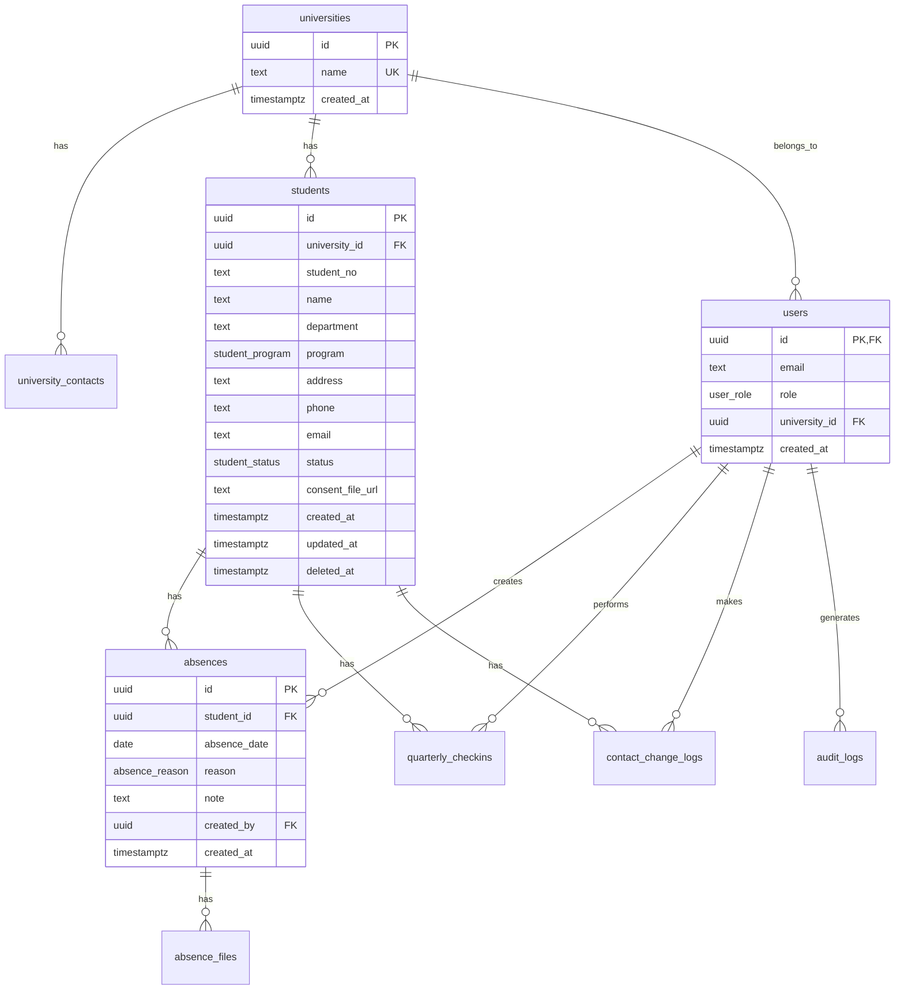

# 외국인 유학생 리스크 관리 ERP - 데이터베이스 스키마

> **버전**: 1.0  
> **최종 수정일**: 2026-01-08  
> **데이터베이스**: PostgreSQL (Supabase)

---

## 1. 개요

### 1.1 설계 원칙

| 원칙 | 설명 |
|------|------|
| **UUID 기반 PK** | 모든 테이블의 기본키는 UUID 사용 |
| **Soft Delete** | 학생 데이터는 `deleted_at` 컬럼으로 소프트 삭제 |
| **RLS 적용** | 모든 테이블에 Row Level Security 정책 적용 |
| **타임존 인식** | 모든 시간 필드는 `TIMESTAMPTZ` 사용 |

### 1.2 ERD 다이어그램



---

## 2. 사용자 정의 타입 (ENUM)

### 2.1 user_role

| 값 | 설명 | 권한 |
|----|------|------|
| `admin` | 시스템 관리자 | 전체 Read/Write |
| `nepal_agency` | 네팔 유학원 | 학생/결석 CRUD |
| `university` | 대학교 국제처 | 소속 학생 Read Only |

### 2.2 student_program

| 값 | 설명 |
|----|------|
| `language` | 어학연수 |
| `bachelor` | 학사 |
| `master` | 석사 |
| `phd` | 박사 |

### 2.3 student_status

| 값 | 설명 |
|----|------|
| `enrolled` | 재학 중 |
| `graduated` | 졸업 |
| `completed` | 수료 |
| `withdrawn` | 자퇴 |
| `expelled` | 제적 |

### 2.4 absence_reason

| 값 | 설명 |
|----|------|
| `illness` | 질병 |
| `personal` | 개인 사정 |
| `other` | 기타 |

### 2.5 audit_action_type

| 값 | 설명 |
|----|------|
| `login` | 로그인 (성공/실패) |
| `logout` | 로그아웃 |
| `download` | 파일 다운로드 |

### 2.6 contact_field

| 값 | 설명 |
|----|------|
| `phone` | 휴대폰번호 |
| `address` | 주소 |
| `email` | 이메일 |

---

## 3. 테이블 상세

### 3.1 universities (대학교)

> 제휴 대학교 정보를 저장합니다.

| 컬럼 | 타입 | 제약조건 | 설명 |
|------|------|----------|------|
| `id` | UUID | PK, DEFAULT gen_random_uuid() | 고유 식별자 |
| `name` | TEXT | NOT NULL, UNIQUE | 대학교명 |
| `created_at` | TIMESTAMPTZ | DEFAULT NOW() | 생성일시 |

---

### 3.2 university_contacts (대학교 담당자)

> 대학교별 결석 알림 수신 담당자 이메일 (최소 1명, 최대 2명)

| 컬럼 | 타입 | 제약조건 | 설명 |
|------|------|----------|------|
| `id` | UUID | PK | 고유 식별자 |
| `university_id` | UUID | FK → universities(id), ON DELETE CASCADE | 소속 대학교 |
| `email` | TEXT | NOT NULL | 담당자 이메일 |
| `is_primary` | BOOLEAN | DEFAULT FALSE | 대표 담당자 여부 |
| `created_at` | TIMESTAMPTZ | DEFAULT NOW() | 생성일시 |

**제약조건**:
- `UNIQUE (university_id, email)` - 같은 대학에 중복 이메일 방지

---

### 3.3 users (사용자)

> Supabase Auth와 연동된 사용자 프로필

| 컬럼 | 타입 | 제약조건 | 설명 |
|------|------|----------|------|
| `id` | UUID | PK, FK → auth.users(id), ON DELETE CASCADE | Supabase Auth ID |
| `email` | TEXT | NOT NULL | 이메일 |
| `role` | user_role | NOT NULL | 사용자 역할 |
| `university_id` | UUID | FK → universities(id), ON DELETE SET NULL | 소속 대학 (university 역할만) |
| `created_at` | TIMESTAMPTZ | DEFAULT NOW() | 생성일시 |

---

### 3.4 students (학생)

> 유학생 정보 (핵심 테이블)

| 컬럼 | 타입 | 제약조건 | 설명 |
|------|------|----------|------|
| `id` | UUID | PK | 고유 식별자 |
| `university_id` | UUID | FK → universities(id), ON DELETE RESTRICT, NOT NULL | 소속 대학교 |
| `student_no` | TEXT | NOT NULL | 학번 |
| `name` | TEXT | NOT NULL | 이름 |
| `department` | TEXT | NOT NULL | 학과 |
| `program` | student_program | NOT NULL | 프로그램 구분 |
| `address` | TEXT | NOT NULL | 주소 |
| `phone` | TEXT | NOT NULL | 휴대폰번호 |
| `email` | TEXT | NULL | 이메일 (선택) |
| `status` | student_status | NOT NULL, DEFAULT 'enrolled' | 재학 상태 |
| `consent_file_url` | TEXT | NULL | 개인정보 동의서 파일 URL |
| `created_at` | TIMESTAMPTZ | DEFAULT NOW() | 생성일시 |
| `updated_at` | TIMESTAMPTZ | DEFAULT NOW() | 수정일시 |
| `deleted_at` | TIMESTAMPTZ | NULL | 삭제일시 (Soft Delete) |

**제약조건**:
- `UNIQUE (university_id, program, student_no)` - 대학+프로그램+학번 조합 고유

**인덱스**:
- `idx_students_university` - university_id
- `idx_students_status` - status
- `idx_students_deleted_at` - deleted_at (부분 인덱스)

---

### 3.5 absences (결석)

> 학생 결석 기록

| 컬럼 | 타입 | 제약조건 | 설명 |
|------|------|----------|------|
| `id` | UUID | PK | 고유 식별자 |
| `student_id` | UUID | FK → students(id), ON DELETE CASCADE, NOT NULL | 학생 |
| `absence_date` | DATE | NOT NULL | 결석일 |
| `reason` | absence_reason | NOT NULL | 결석 사유 |
| `note` | TEXT | NULL | 비고 |
| `created_by` | UUID | FK → users(id), NOT NULL | 기록자 |
| `created_at` | TIMESTAMPTZ | DEFAULT NOW() | 생성일시 |

**제약조건**:
- `UNIQUE (student_id, absence_date)` - 같은 학생 같은 날짜 중복 방지

**인덱스**:
- `idx_absences_student` - student_id
- `idx_absences_date` - absence_date

---

### 3.6 absence_files (결석 증빙 파일)

> 결석 증빙 서류 (진단서 등)

| 컬럼 | 타입 | 제약조건 | 설명 |
|------|------|----------|------|
| `id` | UUID | PK | 고유 식별자 |
| `absence_id` | UUID | FK → absences(id), ON DELETE CASCADE, NOT NULL | 결석 레코드 |
| `file_path` | TEXT | NOT NULL | Storage 경로 (UUID 파일명) |
| `original_name` | TEXT | NOT NULL | 원본 파일명 |
| `created_at` | TIMESTAMPTZ | DEFAULT NOW() | 생성일시 |

---

### 3.7 quarterly_checkins (분기별 점검)

> 3개월마다 수행하는 학생 연락처 확인 기록

| 컬럼 | 타입 | 제약조건 | 설명 |
|------|------|----------|------|
| `id` | UUID | PK | 고유 식별자 |
| `student_id` | UUID | FK → students(id), ON DELETE CASCADE, NOT NULL | 학생 |
| `check_in_date` | DATE | NOT NULL | 점검일 |
| `phone_verified` | BOOLEAN | NOT NULL, DEFAULT FALSE | 휴대폰번호 일치 확인 |
| `address_verified` | BOOLEAN | NOT NULL, DEFAULT FALSE | 주소 일치 확인 |
| `email_verified` | BOOLEAN | NOT NULL, DEFAULT FALSE | 이메일 일치 확인 |
| `checked_by` | UUID | FK → users(id), NOT NULL | 점검자 |
| `created_at` | TIMESTAMPTZ | DEFAULT NOW() | 생성일시 |

**인덱스**:
- `idx_checkins_student` - student_id
- `idx_checkins_date` - check_in_date

---

### 3.8 contact_change_logs (연락처 변경 이력)

> 학생 연락처 변경 내역 자동 기록

| 컬럼 | 타입 | 제약조건 | 설명 |
|------|------|----------|------|
| `id` | UUID | PK | 고유 식별자 |
| `student_id` | UUID | FK → students(id), ON DELETE CASCADE, NOT NULL | 학생 |
| `field_name` | contact_field | NOT NULL | 변경된 필드 |
| `old_value` | TEXT | NULL | 변경 전 값 |
| `new_value` | TEXT | NOT NULL | 변경 후 값 |
| `changed_by` | UUID | FK → users(id), NOT NULL | 변경자 |
| `check_in_date` | DATE | NULL | 점검일 (Check-in 시 변경인 경우) |
| `created_at` | TIMESTAMPTZ | DEFAULT NOW() | 생성일시 |

**인덱스**:
- `idx_contact_logs_student` - student_id

---

### 3.9 audit_logs (감사 로그)

> 시스템 접속 및 활동 로그

| 컬럼 | 타입 | 제약조건 | 설명 |
|------|------|----------|------|
| `id` | UUID | PK | 고유 식별자 |
| `user_id` | UUID | FK → users(id), ON DELETE SET NULL, NULL | 사용자 (로그인 실패 시 NULL) |
| `action_type` | audit_action_type | NOT NULL | 활동 유형 |
| `details` | JSONB | NULL | 추가 정보 (이메일, 파일명 등) |
| `ip_address` | INET | NULL | IP 주소 |
| `created_at` | TIMESTAMPTZ | DEFAULT NOW() | 생성일시 |

**인덱스**:
- `idx_audit_logs_user` - user_id
- `idx_audit_logs_action` - action_type
- `idx_audit_logs_created` - created_at

---

## 4. Row Level Security (RLS) 정책

### 4.1 헬퍼 함수

```sql
-- 현재 사용자 역할 조회
CREATE FUNCTION get_user_role() RETURNS user_role

-- 현재 사용자 소속 대학교 ID 조회
CREATE FUNCTION get_user_university_id() RETURNS UUID
```

### 4.2 권한 매트릭스

| 테이블 | admin | nepal_agency | university |
|--------|-------|--------------|------------|
| universities | CRUD | R | R (자신만) |
| university_contacts | CRUD | R | R (자신만) |
| users | CRUD | R (자신만) | R (자신만) |
| students | CRUD | CRUD | R (소속만) |
| absences | CRUD | CRUD | R (소속만) |
| absence_files | CRUD | CRUD | R (소속만) |
| quarterly_checkins | CRUD | CRUD | - |
| contact_change_logs | CRUD | CRUD | - |
| audit_logs | R | - | - |

---

## 5. 트리거

### 5.1 updated_at 자동 갱신

```sql
CREATE TRIGGER students_updated_at
  BEFORE UPDATE ON students
  FOR EACH ROW
  EXECUTE FUNCTION update_updated_at_column();
```

---

## 6. 데이터 보관 정책

| 데이터 유형 | 보관 기간 | 파기 방식 |
|-------------|-----------|-----------|
| 학생 개인정보 | 졸업/수료 후 1년 | Soft Delete → Hard Delete |
| 결석 기록 | 졸업/수료 후 1년 | Soft Delete → Hard Delete |
| 증빙 파일 | 졸업/수료 후 1년 | Storage에서 영구 삭제 |
| 접속/다운로드 로그 | 3년 | 자동 Hard Delete |

---

## 7. Supabase Storage 버킷

| 버킷 | 용도 | 접근 권한 |
|------|------|-----------|
| `consent-files` | 개인정보 동의서 | admin, nepal_agency |
| `absence-files` | 결석 증빙 서류 | admin, nepal_agency, university (소속만) |

**파일명 규칙**: UUID로만 저장 (개인정보 노출 방지)

---

## 8. 마이그레이션 파일

- `supabase/migrations/20250108_initial_schema.sql` - 초기 스키마
